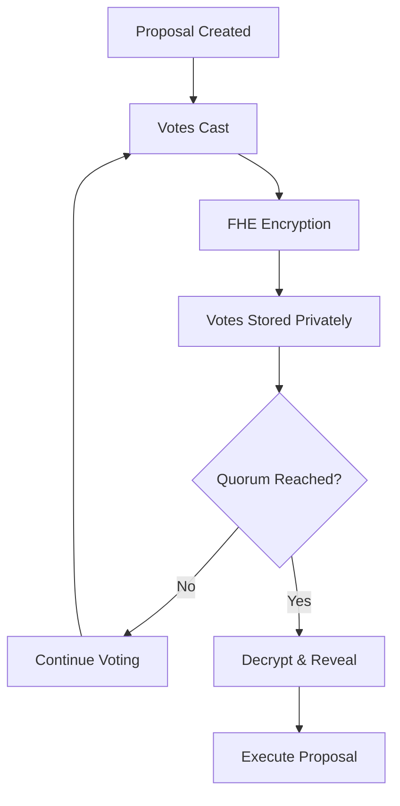

# 🛡️ Vault Guard Cloak

> **Revolutionary Confidential Multisig Treasury with Encrypted Governance**

A cutting-edge Web3 application that revolutionizes treasury management through **Fully Homomorphic Encryption (FHE)** technology, ensuring votes remain completely confidential until quorum is reached.

[](https://opensource.org/licenses/MIT)
[](https://www.typescriptlang.org/)
[](https://reactjs.org/)
[](https://vitejs.dev/)

## ✨ Key Features

### 🔐 **Confidential Voting System**
- **FHE-Encrypted Votes**: Individual votes remain completely private until quorum threshold
- **Bias Prevention**: Eliminates vote manipulation through cryptographic privacy
- **Transparent Results**: Full transparency once quorum is reached

### 🏛️ **Enterprise-Grade Security**
- **Multisig Treasury**: Advanced multi-signature wallet integration
- **Smart Contract Security**: Audited Solidity contracts with FHE integration
- **Real-time Governance**: Instant proposal creation and voting

### 🌐 **Modern Web3 Stack**
- **Wallet Integration**: Seamless connection with RainbowKit, MetaMask, and more
- **Responsive Design**: Beautiful UI built with shadcn/ui and Tailwind CSS
- **Type Safety**: Full TypeScript implementation for robust development

## 🚀 Technology Stack

| Category | Technology | Purpose |
|----------|------------|---------|
| **Frontend** | React 18 + TypeScript | Modern UI framework |
| **Build Tool** | Vite | Fast development and building |
| **Styling** | Tailwind CSS + shadcn/ui | Responsive design system |
| **Web3** | RainbowKit + Wagmi + Viem | Wallet connectivity |
| **Blockchain** | Ethereum Sepolia | Testnet deployment |
| **Encryption** | Zama FHE | Confidential voting |
| **Smart Contracts** | Solidity | On-chain logic |

## 🎯 How It Works



1. **Proposal Creation**: Treasury members create governance proposals
2. **Confidential Voting**: Votes are encrypted using FHE technology
3. **Quorum Monitoring**: System tracks encrypted vote count
4. **Transparent Execution**: Votes revealed only when quorum reached
5. **Secure Execution**: Approved proposals execute automatically

## 🛠️ Quick Start

### Prerequisites
- **Node.js** 18+ and npm
- **Git** for version control
- **Web3 Wallet** (MetaMask, Rainbow, etc.)

### Installation

```bash
# Clone the repository
git clone https://github.com/yourusername/vault-guard-cloak.git
cd vault-guard-cloak

# Install dependencies
npm install

# Set up environment variables
cp .env.example .env.local
```

### Environment Configuration

Create a `.env.local` file with your configuration:

```env
# Blockchain Configuration
VITE_CHAIN_ID=11155111
VITE_RPC_URL=https://sepolia.infura.io/v3/YOUR_INFURA_KEY
VITE_WALLET_CONNECT_PROJECT_ID=YOUR_WALLET_CONNECT_ID

# Contract Addresses (Deploy contracts first)
VITE_VAULT_CONTRACT_ADDRESS=0x...
VITE_FHE_CONTRACT_ADDRESS=0x...
```

### Development

```bash
# Start development server
npm run dev

# Build for production
npm run build

# Preview production build
npm run preview
```

The application will be available at `http://localhost:8080`.

## 📋 Smart Contract Features

### Core Functionality
- **FHE-Encrypted Voting**: All votes encrypted until quorum reached
- **Treasury Management**: Secure fund storage and withdrawal
- **Proposal System**: Create, vote, and execute governance proposals
- **Reputation Tracking**: Monitor participant voting history

### Security Measures
- **Multi-signature Requirements**: Configurable quorum thresholds
- **Time-locked Proposals**: Automatic expiration for inactive proposals
- **Emergency Procedures**: Circuit breakers for critical situations

## 🌍 Deployment Options

### 🚀 **Recommended Platforms**

| Platform | Best For | Setup Time | Cost |
|----------|----------|------------|------|
| **Cloudflare Pages** | Production Web3 apps | 5 minutes | Free |
| **Vercel** | Development & testing | 3 minutes | Free tier |
| **Netlify** | JAMstack applications | 5 minutes | Free tier |
| **GitHub Pages** | Open source projects | 10 minutes | Free |

### Quick Deploy

[](https://vercel.com/new/clone?repository-url=https://github.com/yourusername/vault-guard-cloak)
[](https://app.netlify.com/start/deploy?repository=https://github.com/yourusername/vault-guard-cloak)

### Manual Deployment

```bash
# Build the project
npm run build

# Deploy dist/ folder to your hosting service
# See deployment guides in /docs folder
```

## 📚 Documentation

- **[Vercel Deployment Guide](./VERCEL_DEPLOYMENT.md)** - Step-by-step Vercel setup
- **[Netlify Deployment Guide](./NETLIFY_DEPLOYMENT.md)** - Netlify configuration
- **[Cloudflare Deployment Guide](./CLOUDFLARE_DEPLOYMENT.md)** - Cloudflare Pages setup
- **[GitHub Pages Guide](./GITHUB_PAGES_DEPLOYMENT.md)** - GitHub Pages deployment
- **[Platform Comparison](./DEPLOYMENT_PLATFORMS_COMPARISON.md)** - Choose the best platform

## 🔒 Security & Privacy

### Privacy-First Design
- **Zero-Knowledge Voting**: Individual votes never revealed until quorum
- **Cryptographic Guarantees**: FHE ensures mathematical privacy
- **No Vote Tracking**: Impossible to correlate votes to individuals

### Security Features
- **Smart Contract Audits**: Regular security assessments
- **Multi-layer Encryption**: FHE + standard encryption
- **Access Controls**: Role-based permissions
- **Emergency Procedures**: Circuit breakers and pause mechanisms

## 🤝 Contributing

We welcome contributions! Please see our [Contributing Guidelines](CONTRIBUTING.md) for details.

### Development Workflow

```bash
# Fork the repository
git fork https://github.com/yourusername/vault-guard-cloak.git

# Create feature branch
git checkout -b feature/amazing-feature

# Make changes and commit
git commit -m "Add amazing feature"

# Push and create PR
git push origin feature/amazing-feature
```

### Code Standards
- **TypeScript**: Strict type checking enabled
- **ESLint**: Code quality and consistency
- **Prettier**: Automatic code formatting
- **Testing**: Unit and integration tests

## 📊 Project Status

- ✅ **Core FHE Integration**: Complete
- ✅ **Wallet Connectivity**: Complete
- ✅ **UI/UX Design**: Complete
- ✅ **Smart Contracts**: Complete
- 🔄 **Security Audits**: In Progress
- 🔄 **Mainnet Deployment**: Planned

## 🏆 Acknowledgments

- **[Zama](https://zama.ai/)** - FHE technology and research
- **[RainbowKit](https://rainbowkit.com/)** - Wallet connection framework
- **[shadcn/ui](https://ui.shadcn.com/)** - Beautiful component library
- **[Vite](https://vitejs.dev/)** - Lightning-fast build tool

## 📄 License

This project is licensed under the **MIT License** - see the [LICENSE](LICENSE) file for details.

## 🆘 Support

- **Documentation**: Check the `/docs` folder for detailed guides
- **Issues**: [GitHub Issues](https://github.com/yourusername/vault-guard-cloak/issues)
- **Discussions**: [GitHub Discussions](https://github.com/yourusername/vault-guard-cloak/discussions)

---

<div align="center">

**Built with ❤️ for the Web3 community**

[⭐ Star this repo](https://github.com/yourusername/vault-guard-cloak) • [🐛 Report Bug](https://github.com/yourusername/vault-guard-cloak/issues) • [💡 Request Feature](https://github.com/yourusername/vault-guard-cloak/issues)

</div>